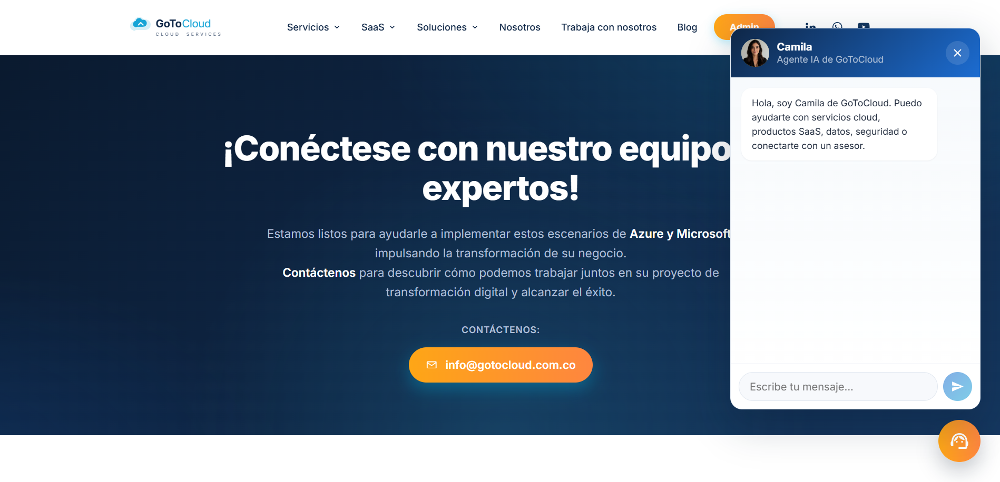
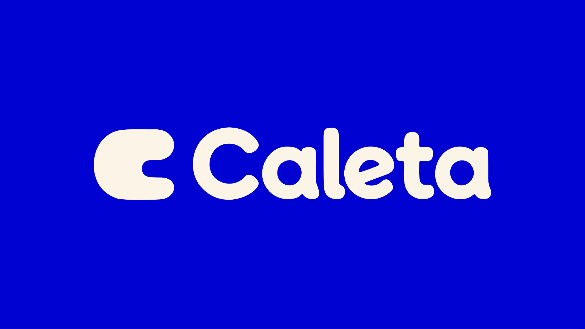

# Han's De Ávila

**Desarrollador Fullstack en formación | Web, IA y producto digital**

Soy estudiante de Desarrollo de Software enfocado en construir soluciones funcionales con una vibra creativa y profesional. Me interesa desarrollar productos reales, automatizaciones y experiencias interactivas que conecten bien con las personas.

Me gusta combinar estructura técnica, creatividad visual y enfoque de producto para construir soluciones que se sientan útiles y memorables.

---

## 👨‍💻 Sobre mí

- Estudiante y desarrollador enfocado en software, desarrollo web y experiencias digitales.
- Desde mi etapa escolar he fortalecido mis bases en tecnología, programación y lógica computacional.
- He participado en mantenimiento web institucional, desarrollo de videojuegos en Game Jam y construcción de productos personales como **NixoCore**.
- Actualmente estoy enfocado en crecer como perfil fullstack, mejorar mi criterio técnico y presentar proyectos que demuestren iniciativa, resolución de problemas y evolución constante.

---

## 🛠️ Stack y herramientas

**Base actual (con lo que ya trabajo)**
- Vibe Coding / IA aplicada · Python · HTML · CSS · Supabase · GitHub · VS Code

**En aprendizaje activo**
- React · JavaScript · MySQL · PostgreSQL · APIs REST · Arquitectura Fullstack

**Herramientas extra**
- Unity · C# · UI Design · Game Design · Trabajo en equipo · Aprendizaje rápido

---

## 🚀 Proyectos

### Camila — Agente de voz con IA (Hackathon GoToCloud, 2026)
Agente de voz para contact centers que maneja conversaciones en tiempo real a través de llamadas telefónicas, integrando IA generativa y síntesis de voz.
`Gemini Live API` · `Twilio` · `FastAPI` · `Supabase` · `React 19` · `TypeScript`
🔗 https://gotocloud.vercel.app/

### Caleta — Finanzas personales con IA (Proyecto personal, 2026 · En construcción)
App de finanzas personales para jóvenes colombianos. Registra gastos analizando capturas de Nequi y Bancolombia con visión artificial. Incluye dashboard de movimientos y categorización automática.
`Next.js` · `Supabase` · `Prisma` · `Claude API` · `TypeScript` · `PWA`
🔗 https://github.com/srhanscho/Caleta

### NixoCore — Automatización, software web e IA (Producto propio, 2026 · Destacado)
Proyecto orientado a producto digital para explorar automatización, organización de procesos y soluciones útiles para negocios. Una base SaaS con visión práctica y potencial de crecimiento.
`Python` · `HTML` · `CSS` · `Supabase` · `IA aplicada` · `Producto digital`
🔗 https://nixo-core.vercel.app/

### Dungeon Trade — Videojuego (Game Jam, 2025)
Videojuego de fantasía medieval donde la magia es un recurso escaso. Desarrollado en Caribe Game Jam, con trabajo en desarrollo, diseño de juego, diseño de interfaz y construcción narrativa.
`Unity` · `C#` · `Game Design` · `UI Design` · `Narrativa`
🔗 https://yasalcedo86.itch.io/dungeon-trade

### Mythic Clash API — API REST (Proyecto backend, 2026)
API REST para gestionar personajes RPG y simular batallas estratégicas. Proyecto académico para practicar backend, CRUD, persistencia de datos y lógica de negocio, con arquitectura separada en rutas, servicios y repositorio.
`Python` · `Flask` · `SQLite` · `REST API` · `CRUD` · `JSON`
🔗 https://github.com/srhanscho/mythic-clash-api

---

## 🎓 Línea de tiempo

- **2024** — Bachiller técnico en TI (énfasis en programación)
- **2024** — Técnico en programación de software — SENA
- **2025 – Actualidad** — Técnico Profesional en Desarrollo de Software — Universidad de la Costa
- **2025** — Web Master — Colegio Infantil Garabatos de Colores (HTML5, CSS3)
- **2025** — Participación en Caribe Game Jam
- **2026** — Participación en Hackathon CaribeTech (24 horas) — donde construí **Camila**, un agente de voz con IA

---

## 🏆 Logros

- Certificación en programación de software (SENA)
- Formación universitaria en Desarrollo de Software (Universidad de la Costa)
- Participación en Caribe Game Jam
- Bachiller técnico en TI con énfasis en programación

---

## 📫 Contacto

- **Correo:** hsdeavila@outlook.com
- **GitHub:** [github.com/srhanscho](https://github.com/srhanscho)
- **Instagram:** [@hansdeavila](https://www.instagram.com/hansdeavila)
- **WhatsApp:** [wa.me/573226787358](https://wa.me/573226787358)

---

© 2026 Han's De Ávila — Todos los derechos reservados
